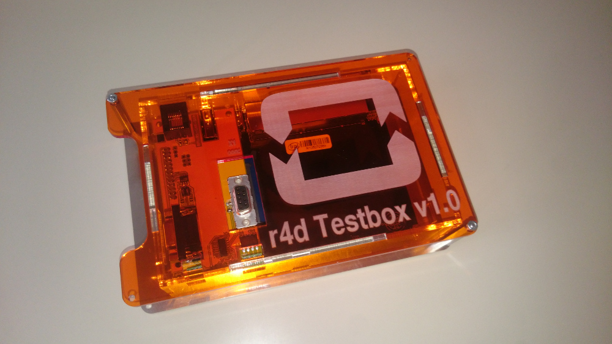
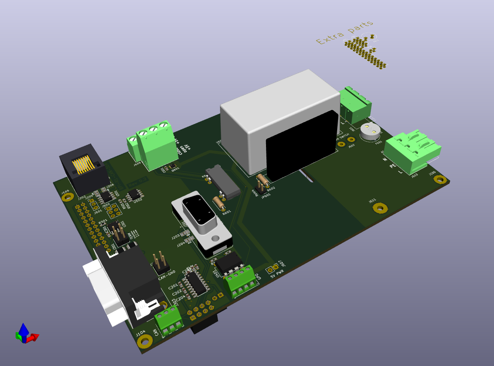
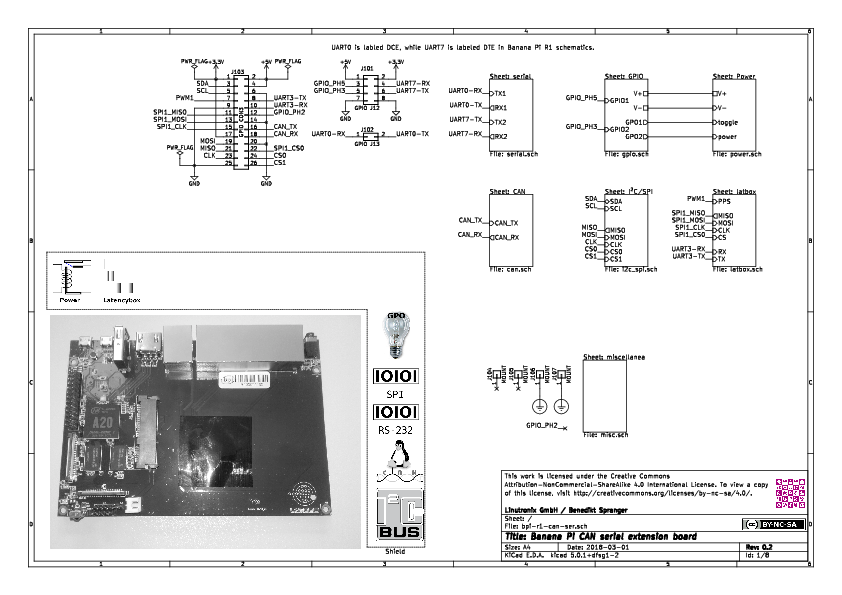
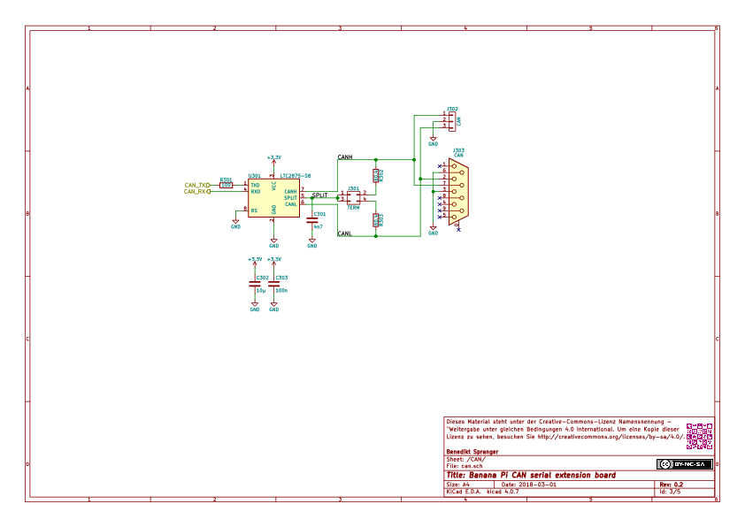
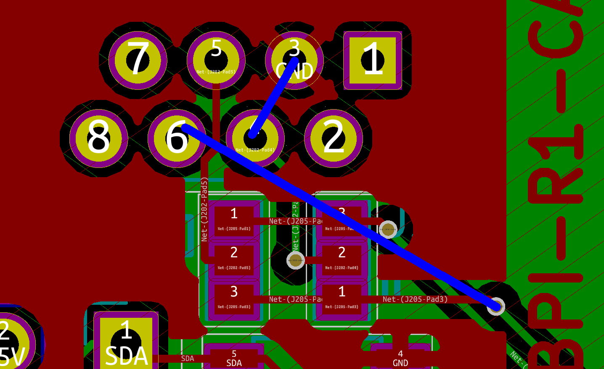
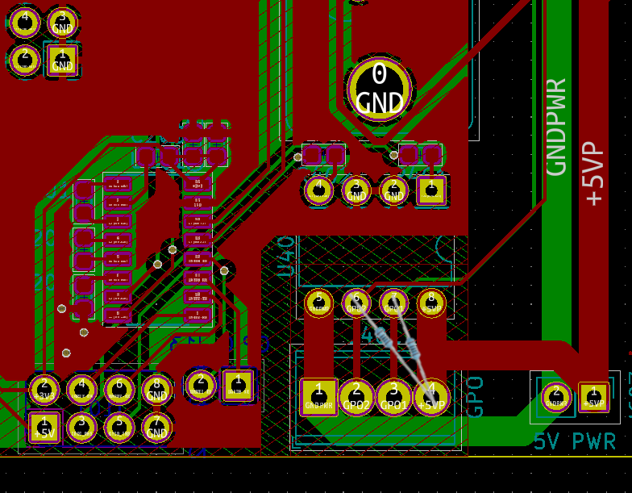

= TESTBOX
:toc:
:toclevels: 3

This git repository hosts all related drawings, layouts and schematics
to build a TESTBOX test system.

But it doesn't include the project specific libraries. However they are
referenced as git submodules. To retrieve them use 'git submodule init' and
'git submodule update' before opening the project in kicad.

The project was verified to work with kicad version 5.

== preliminary remarks
One part of the Real Time Linux collaborative project is the continous
integration project https://ci-rt.linutronix.de/RT-Test/[CI-RT].

One part of the testsuite performs different tests on the devices under test
(DUT). To ease the hardware integration of the DUT to the test infrastructure
the DUT need to comply with some
https://ci-rt.linutronix.de/download/system-requirements.pdf[hardware
requirements].

It turned out that some DUTs need special hardware extensions to meet the
test infrastructure hardware requirements. Furthermore the wish for hardware
assisted tests grow up.

The idea of a standardized adaption system was born: the TESTBOX.

== hardware
The TESTBOX is based on the http://www.banana-pi.org/r1.html[Banana Pi R1
router board]. This board includes several physical interfaces:

 * 5-port Ethernet Switch
 * CAN
 * GPIOs
 * I2C
 * RS232
 * SPI
 * USB

The board is supported by the mainline
https://git.kernel.org/pub/scm/linux/kernel/git/stable/linux-stable.git/tree/arch/arm/boot/dts/sun7i-a20-lamobo-r1.dts?h=linux-4.18.y[Linux Kernel].
Since most interfaces are routed to pinheaders and lack of a physical adaption
a board shield was developed and is now available in version 2.

http://kicad-pcb.org[KiCAD] is used to create all schematics and the layout.

=== shield

Changes in version 2 of the shield:

 * 5V DC Powersupply added
 * 240V AC Powerswitch added
 * relay added
 * serial EEPROM added
 * secure store for private keys added (ATECC)
 * minor fixes

==== 3D model
A VRML model of the shield is also link:3D/bpi-r1-can-ser.wrl[available].

==== schematic
The complete schematic is available as
link:schematic/bpi-r1-can-ser.pdf[PDF].

===== overview

===== serial ports

===== CAN interface

===== general purpose output

===== I2C / SPI

===== Power

===== latbox (not implemented)

===== miscellanea

==== gerber
===== PCB edges and cuts

===== top copper layer

===== top silk screen

===== bottom copper layer

===== bottom silk screen

==== Errata
===== TIA-561 serial port
The pinout of the RJ-45 connector was mixed up (off by one)

===== GPO
The optocoupler is open collector and not TTL. Add 100 Ohm pullups.

== software
To create the root file system of the TESTBOX http://elbe-rfs.org/[E.L.B.E.]
is used. E.L.B.E. provides a reproducable way to create
http://debian.org[Debian-based] root file systems.

=== E.L.B.E. root file system
The receipe to build a root file system for the TESTBOX can be found under
https://github.com/ci-rt/testbox-rfs[].
